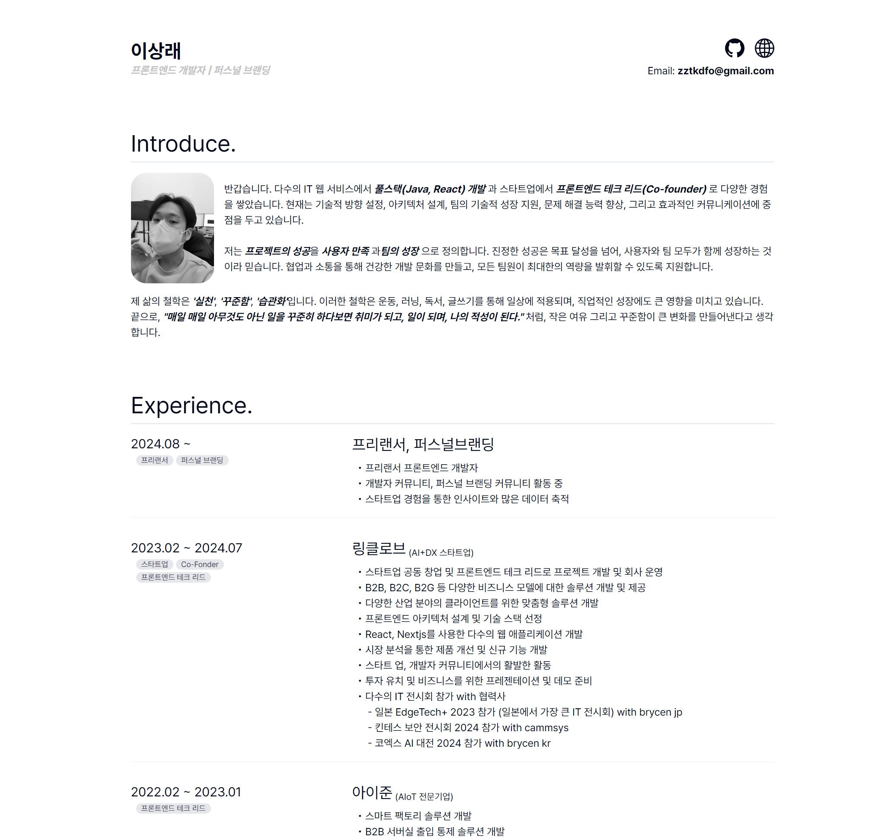

# 이상래 - 프론트엔드 개발자 & 퍼스널 브랜딩 전문가

## 👋 소개

  

안녕하세요, 저는 이상래입니다. 다년간의 경력을 통해 **풀스택(Java, React) 개발자**로서 성장해왔으며, 스타트업에서 공동 창업자이자 **프론트엔드 테크 리드**로 다양한 프로젝트를 성공적으로 이끌었습니다. 현재는 기술적 방향 설정, 아키텍처 설계, 팀의 기술적 성장 지원, 문제 해결 능력 향상, 그리고 효과적인 커뮤니케이션에 중점을 두고 있습니다.

저는 프로젝트의 성공을 **사용자 만족**과 **팀의 성장**으로 정의합니다. 진정한 성공은 목표 달성을 넘어, 사용자와 팀 모두가 함께 성장하는 것이라고 믿습니다. 협업과 소통을 통해 건강한 개발 문화를 만들고, 모든 팀원이 최대한의 역량을 발휘할 수 있도록 지원합니다.

제 삶의 철학은 **'실천'**, **'꾸준함'**, **'습관화'** 입니다. 이러한 철학은 운동, 러닝, 독서, 글쓰기를 통해 일상에 적용되며, 직업적인 성장에도 큰 영향을 미치고 있습니다. 끝으로, "매일 매일 아무것도 아닌 일을 꾸준히 하다 보면 취미가 되고, 일이 되며, 나의 적성이 된다."처럼, 작은 여유 그리고 꾸준함이 큰 변화를 만들어낸다고 생각합니다.

## 🔗 소셜 링크

- [GitHub](https://github.com/zztkdfo/)
- [포트폴리오](https://portfolio-zztkdfo.vercel.app/)
- **Email:** zztkdfo@gmail.com

## 💼 경력

### 프리랜서 & 퍼스널 브랜딩 (2024.08 ~ 현재)

- 프리랜서 프론트엔드 개발자
- 개발자 커뮤니티 및 퍼스널 브랜딩 커뮤니티 활동

### 링클로브 (AI+DX 스타트업) - Co-Founder & 프론트엔드 테크 리드 (2023.02 ~ 2024.07)

- 스타트업 공동 창업 및 프론트엔드 테크 리드로 프로젝트 개발 및 회사 운영
- B2B, B2C, B2G 솔루션 개발 및 제공
- React, Next.js를 사용한 다수의 웹 애플리케이션 개발

### 아이준 (AIoT 전문기업) - 프론트엔드 테크 리드 (2022.02 ~ 2023.01)

- 스마트 팩토리 솔루션 개발
- B2B 서버실 출입 통제 솔루션 개발

### NCITS (엔씨소프트 자회사) - 백엔드 & 프론트엔드 개발자 (2014.07 ~ 2022.01)

- 엔씨소프트 ITSM 시스템 Frontend, Backend 개발
- 엔씨다이노스 선수 관리 시스템 풀스택 개발

## 🛠 기술 스택

### Frontend

- Next.js, React, Three.js, HTML, CSS, JavaScript, TypeScript, TailwindCSS
- Redux, React Query, Recoil, Ant Design, Shadcn/UI, MUI, Bootstrap 등

### Backend

- Java, Spring Boot, Spring Data JPA, Redis, Node.js, Express, MySQL, MSSQL
- GraphQL, ElasticSearch 등

### Common

- Git, GitHub, Jira, Confluence, Trello, Slack, Docker, Jenkins
- Visual Studio Code, Figma 등

## 📚 글쓰기

나의 가치관인 **실천**, **꾸준함**, **습관**에 대해 아래의 글들에서 더 자세히 표현하고 있습니다:
- [AI 시대, 개발자는 대체될까? 아니, 진화할까?](https://disquiet.io/@zztkdfo/makerlog/ai-%EC%8B%9C%EB%8C%80-%EA%B0%9C%EB%B0%9C%EC%9E%90%EB%8A%94-%EB%8C%80%EC%B2%B4%EB%90%A0%EA%B9%8C-%EC%95%84%EB%8B%88-%EC%A7%84%ED%99%94%ED%95%A0%EA%B9%8C)
- [프리랜서 개발자로 선택한 이유: 안정적인 수입과 자유로운 시간의 균형 💼⏰](https://disquiet.io/@zztkdfo/makerlog/%ED%94%84%EB%A6%AC%EB%9E%9C%EC%84%9C-%EA%B0%9C%EB%B0%9C%EC%9E%90%EB%A1%9C-%EC%84%A0%ED%83%9D%ED%95%9C-%EC%9D%B4%EC%9C%A0-%EC%95%88%EC%A0%95%EC%A0%81%EC%9D%B8-%EC%88%98%EC%9E%85%EA%B3%BC-%EC%9E%90%EC%9C%A0%EB%A1%9C%EC%9A%B4-%EC%8B%9C%EA%B0%84%EC%9D%98-%EA%B7%A0%ED%98%95)
- [내 꿈 vs 남의 사업: 주체성에 대해서..](https://disquiet.io/@zztkdfo/makerlog/%EB%82%B4-%EA%BF%88-vs-%EB%82%A8%EC%9D%98-%EC%82%AC%EC%97%85)
- [스타트업 창업가에서 프리랜서로의 삶: 나의 생각과 행동이 멀지 않기를](https://disquiet.io/@zztkdfo/makerlog/%EC%8A%A4%ED%83%80%ED%8A%B8%EC%97%85-%EC%B0%BD%EC%97%85%EA%B0%80%EC%97%90%EC%84%9C-%ED%94%84%EB%A6%AC%EB%9E%9C%EC%84%9C%EB%A1%9C%EC%9D%98-%EC%82%B6)
- [Remind: 빠르게 실패하기](https://disquiet.io/@zztkdfo/makerlog/remind-%EB%B9%A0%EB%A5%B4%EA%B2%8C-%EC%8B%A4%ED%8C%A8%ED%95%98%EA%B8%B0)
- [스타트업 3년의 기록: 설레임, 도전, 그리고 새로운 시작](https://disquiet.io/@zztkdfo/makerlog/%EC%8A%A4%ED%83%80%ED%8A%B8%EC%97%85-3%EB%85%84%EC%9D%98-%EA%B8%B0%EB%A1%9D-%EC%84%A4%EB%A0%88%EC%9E%84-%EB%8F%84%EC%A0%84-%EA%B7%B8%EB%A6%AC%EA%B3%A0-%EC%83%88%EB%A1%9C%EC%9A%B4-%EC%8B%9C%EC%9E%91)
- [성숙함의 6가지 명확한 징후: 삶의 깊이를 더하는 지혜](https://disquiet.io/@zztkdfo/makerlog/%EC%84%B1%EC%88%99%ED%95%A8%EC%9D%98-6%EA%B0%80%EC%A7%80-%EB%AA%85%ED%99%95%ED%95%9C-%EC%A7%95%ED%9B%84-%EC%82%B6%EC%9D%98-%EA%B9%8A%EC%9D%B4%EB%A5%BC-%EB%8D%94%ED%95%98%EB%8A%94-%EC%A7%80%ED%98%9C)
- [성공의 80%는 운? 그래서 우리는 더 감사해야 합니다 🍀🙏](https://disquiet.io/@zztkdfo/makerlog/%EC%84%B1%EA%B3%B5%EC%9D%98-80-%EB%8A%94-%EC%9A%B4-%EA%B7%B8%EB%9E%98%EC%84%9C-%EC%9A%B0%EB%A6%AC%EB%8A%94-%EB%8D%94-%EA%B0%90%EC%82%AC%ED%95%B4%EC%95%BC-%ED%95%A9%EB%8B%88%EB%8B%A4)
- [스타트업 운영하면서 흔히 저지르는 5가지 실수 🛠️](https://disquiet.io/@zztkdfo/makerlog/%EC%8A%A4%ED%83%80%ED%8A%B8%EC%97%85-%EC%9A%B4%EC%98%81%ED%95%98%EB%A9%B4%EC%84%9C-%ED%9D%94%ED%9E%88-%EC%A0%80%EC%A7%80%EB%A5%B4%EB%8A%94-5%EA%B0%80%EC%A7%80-%EC%8B%A4%EC%88%98)
- [내가 늦었나? 🤔: 타이밍에 대한 생각들](https://disquiet.io/@zztkdfo/makerlog/%EB%82%B4%EA%B0%80-%EB%8A%A6%EC%97%88%EB%82%98-%ED%83%80%EC%9D%B4%EB%B0%8D%EC%97%90-%EB%8C%80%ED%95%9C-%EC%83%9D%EA%B0%81%EB%93%A4)
- [낫투두(Not To Do) 리스트: 인생을 변화시키는 새로운 시각](https://disquiet.io/@zztkdfo/makerlog/%EB%82%AB%ED%88%AC%EB%91%90-not-to-do-%EB%A6%AC%EC%8A%A4%ED%8A%B8-%EC%9D%B8%EC%83%9D%EC%9D%84-%EB%B3%80%ED%99%94%EC%8B%9C%ED%82%A4%EB%8A%94-%EC%83%88%EB%A1%9C%EC%9A%B4-%EC%8B%9C%EA%B0%81)
- [수요자에서 공급자로의 변환: 글을 쓰면서 변화한 생각과 마인드](https://disquiet.io/@zztkdfo/makerlog/%EC%88%98%EC%9A%94%EC%9E%90%EC%97%90%EC%84%9C-%EA%B3%B5%EA%B8%89%EC%9E%90%EB%A1%9C%EC%9D%98-%EB%B3%80%ED%99%98-%EA%B8%80%EC%9D%84-%EC%93%B0%EB%A9%B4%EC%84%9C-%EB%B3%80%ED%99%94%ED%95%9C-%EC%83%9D%EA%B0%81%EA%B3%BC-%EB%A7%88%EC%9D%B8%EB%93%9C)
- [브랜딩: 한 사람에게 감동을 주어라](https://disquiet.io/@zztkdfo/makerlog/%EB%B8%8C%EB%9E%9C%EB%94%A9-%ED%95%9C-%EC%82%AC%EB%9E%8C%EC%97%90%EA%B2%8C-%EA%B0%90%EB%8F%99%EC%9D%84-%EC%A3%BC%EC%96%B4%EB%9D%BC)
- [일을 할 때, 어떤 Why와 How가 있으신가요?](https://disquiet.io/@zztkdfo/makerlog/%EC%9D%BC%EC%9D%84-%ED%95%A0-%EB%95%8C-%EC%96%B4%EB%96%A4-why%EC%99%80-how%EA%B0%80-%EC%9E%88%EC%9C%BC%EC%8B%A0%EA%B0%80%EC%9A%94)
- [우리는 왜 거절하기 힘들까?](https://disquiet.io/@zztkdfo/makerlog/%EC%9A%B0%EB%A6%AC%EB%8A%94-%EC%99%9C-%EA%B1%B0%EC%A0%88%ED%95%98%EA%B8%B0-%ED%9E%98%EB%93%A4%EA%B9%8C)
- [내가 러닝을 하는 이유.. 내 일을 더 잘하기 위해서!](https://disquiet.io/@zztkdfo/makerlog/%EB%82%B4%EA%B0%80-%EB%9F%AC%EB%8B%9D%EC%9D%84-%ED%95%98%EB%8A%94-%EC%9D%B4%EC%9C%A0-%EB%82%B4-%EC%9D%BC%EC%9D%84-%EB%8D%94-%EC%9E%98%ED%95%98%EA%B8%B0-%EC%9C%84%ED%95%B4%EC%84%9C)
- [왜 실천이 어려울까? 작게.. 작게..](https://disquiet.io/@zztkdfo/makerlog/%EC%99%9C-%EC%8B%A4%EC%B2%9C%EC%9D%B4-%EC%96%B4%EB%A0%A4%EC%9A%B8%EA%B9%8C-%EC%9E%91%EA%B2%8C-%EC%9E%91%EA%B2%8C)
- [첫 글쓰기에 대한 설렘: 작게 시작하는 용기와 꾸준함의 철학](https://disquiet.io/@zztkdfo/makerlog/%EC%B2%AB-%EA%B8%80%EC%93%B0%EA%B8%B0%EC%97%90-%EB%8C%80%ED%95%9C-%EC%84%A4%EB%A0%88%EC%9E%84-%EC%9E%91%EA%B2%8C-%EC%8B%9C%EC%9E%91%ED%95%98%EB%8A%94-%EC%9A%A9%EA%B8%B0%EC%99%80-%EA%BE%B8%EC%A4%80%ED%95%A8%EC%9D%98-%EC%B2%A0%ED%95%99)
- [무신사의 웹 사이트 개편: 모바일 중심으로의 전환](https://disquiet.io/@zztkdfo/makerlog/%EB%AC%B4%EC%8B%A0%EC%82%AC%EC%9D%98-%EC%9B%B9%EC%82%AC%EC%9D%B4%ED%8A%B8-%EA%B0%9C%ED%8E%B8-%EB%AA%A8%EB%B0%94%EC%9D%BC-%EC%A4%91%EC%8B%AC%EC%9C%BC%EB%A1%9C%EC%9D%98-%EC%A0%84%ED%99%98)
